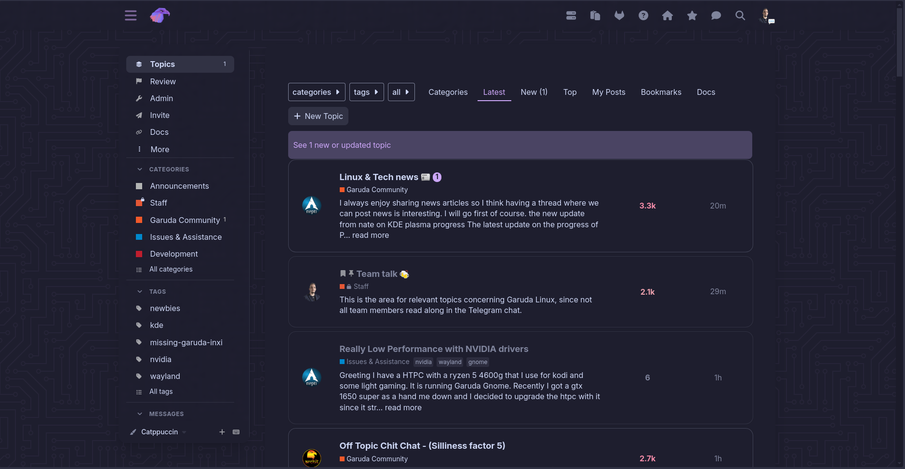
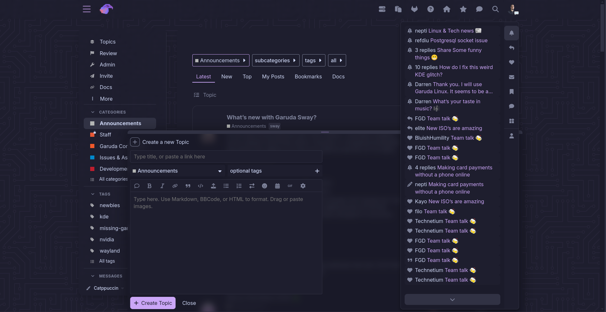
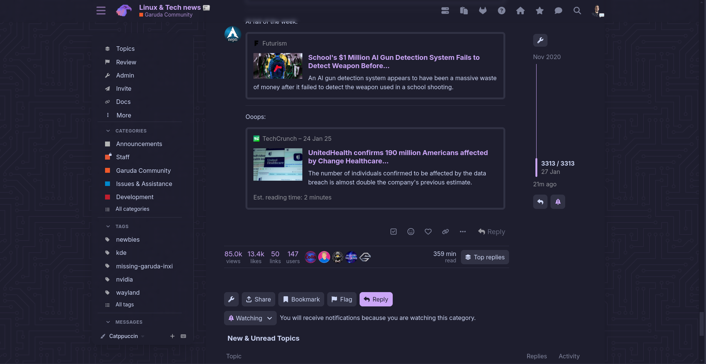

# Catppuccin Discourse

These are the modifications I added to Discourse to make it Catppuccin (mauve) themed, including a decent amount of blur in a few places.

## Screenshots





## Requirements

- [Discourse](https://discourse.org) installed
- [Discourse Air theme](https://meta.discourse.org/t/air-theme/197703), install per instructions

## Color palette

These are partly repeating since Catppuccin is not providing the full 50-900 range of colors. I made up for it by using lots of custom CSS.

~~~json
"Catppuccin Mauve": {
  "primary": "cdd6f4",
  "secondary": "1e1e2e",
  "tertiary": "cba6f7",
  "quaternary": "b7bdf8",
  "header_background": "1e1e2e",
  "header_primary": "cba6f7",
  "highlight": "f2cdcd",
  "danger": "f38ba8",
  "success": "a6e3a1",
  "love": "cba6f7",
  "primary_very_low": "1e1e2e",
  "primary_low": "313244",
  "primary_low_mid": "313244",
  "primary_medium": "7f849c",
  "primary_high": "cdd6f4",
  "primary-50": "313244",
  "primary-100": "535460",
  "primary-200": "666972",
  "primary-300": "7A7C84",
  "primary-400": "313244",
  "primary-500": "A2A3A9",
  "primary-600": "B6B7BC",
  "primary-700": "C7C7C7",
  "primary-800": "DEDFE0",
  "primary-900": "F5F5F5",
  "secondary_low": "CCCCCF",
  "secondary_medium": "91939A",
  "secondary_high": "6A6C76",
  "secondary_very_high": "3D404C",
  "tertiary_low": "4A4463",
  "tertiary_medium": "6E5D92",
  "tertiary_high": "9275C1",
  "quaternary_low": "94e2d5",
  "highlight_low": "eba0ac",
  "highlight_medium": "fab387",
  "highlight_high": "f9e2af",
  "danger_low": "1e1e2e",
  "success_low": "a6e3a1",
  "success_medium": "a6e3a1",
  "love_low": "f2cdcd",
  "selected": "313244",
  "hover": "585b70"
}
~~~

## Custom CSS

The following might be messy, but oh well. It works.
It should be pasted into a new theme component, which is then added to the newly created theme (derived from the Air theme).

```css
#reply-control::before,.chat-drawer-container::before {
backdrop-filter:blur(10px);
background-color:#18182580;
content:'';
inset:0;
position:absolute;
z-index:-1
}

#topic-footer-buttons > div.topic-footer-main-buttons > button > span,button > span,.controls > ul > li > .chat-direct-message-btn > span,.controls > ul > li > .compose-pm > span,.save-changes > .d-button-label,button.btn.btn-text.btn-primary.btn-small.sign-up-button > span,button.btn.btn-icon-text.btn-primary.btn-small.login-button > span {
color:#1e1e2e
}

#topic-progress-wrapper #topic-progress,#topic-progress-wrapper .btn {
margin-left:.5rem;
margin-top:.5rem
}

.archetype-private_message {
--border-radius:8px
}

.archetype-private_message .current-user-post .regular.contents {
background-color:var(--primary-low);
border:unset
}

.archetype-private_message .topic-body .contents.regular,#list-area .show-more .alert,input[type=text],input[type=password],input[type=datetime],input[type=datetime-local],input[type=date],input[type=month],input[type=time],input[type=week],input[type=number],input[type=email],input[type=url],input[type=search],input[type=tel],input[type=color],.select-kit.combo-box .select-kit-header,.d-editor-textarea-wrapper,div.ac-wrap,.fk-d-menu__inner-content,.full-width .contents .topic-list .topic-list-header .topic-list-data.posts,.full-width .contents .topic-list .topic-list-header .topic-list-data.activity,.archetype-private_message .topic-map .participants .user,.user-menu .quick-access-panel li:not(.show-all),.user-notifications-list li:not(.show-all),.chat-composer__inner-container,.chat-message-actions,.select-kit.single-select.dropdown-select-box.is-expanded .select-kit-collection,.select-kit.single-select.dropdown-select-box.is-expanded .select-kit-body,pre > code,aside.onebox,.badge-card,.sidebar-section-link-wrapper,.new-user-wrapper .user-navigation .nav-pills li a,.desktop-view .archetype-private_message .regular.contents,.chat-drawer.is-expanded .chat-drawer-container,.user-menu.revamped #quick-access-profile li,.card-cloak,#topic-progress-wrapper #topic-progress .bg,#topic-progress-wrapper #topic-progress,.user-menu .quick-access-panel .read,.user-notifications-list .read,.user-menu.revamped .tabs-list .btn,.user-menu.revamped .tabs-list .d-modal.json-schema-editor-modal .je-ready .json-editor-btn-add,.d-modal.json-schema-editor-modal .je-ready .user-menu.revamped .tabs-list .json-editor-btn-add,.user-menu.revamped .tabs-list .d-modal.json-schema-editor-modal .je-ready button,.d-modal.json-schema-editor-modal .je-ready .user-menu.revamped .tabs-list button,.sidebar-section-link-wrapper .sidebar-section-link,.d-modal.-max .d-modal__container {
border-radius:8px
}

.chat-message-actions .chat-message-reaction {
background-color:var(--primary-lowest);
border:none;
border-radius:8px
}

.chat-message-actions .chat-message-reaction:not(.reacted):hover,.menu-panel .panel-body-bottom .btn,.menu-panel .panel-body-bottom .d-modal.json-schema-editor-modal .je-ready .json-editor-btn-add,.d-modal.json-schema-editor-modal .je-ready .menu-panel .panel-body-bottom .json-editor-btn-add,.menu-panel .panel-body-bottom .d-modal.json-schema-editor-modal .je-ready button,.d-modal.json-schema-editor-modal .je-ready .menu-panel .panel-body-bottom button,.shortcut-category h2,.admin-site-settings-filter-controls .controls,.admin-site-settings-filter-controls .search.controls,.admin-site-settings-filter-controls,.d-admin-filter {
background-color:var(--primary-low)
}

.chat-message-container,.chat-transcript,.admin-area .sidebar-wrapper .admin-panel,.group-details-container {
background-color:unset
}

.chat-message-separator-date .chat-message-separator__text-container.is-pinned .chat-message-separator__text,.chat-message-separator-date .chat-message-separator__text-container.is-force-pinned .chat-message-separator__text {
background-color:var(--primary-low);
border-color:var(--primary-low);
border-radius:8px;
color:var(--primary)
}

.custom-category-boxes:not(.above-discovery-categories-outlet) .category-box .category-box-inner .category-logo.no-logo-present {
background-color:var(--primary-low)!important
}

.custom-category-boxes:not(.above-discovery-categories-outlet) h3,.custom-category-boxes:not(.above-discovery-categories-outlet) .category-box .category-box-inner .category-logo.no-logo-present .category-abbreviation {
color:var(--primary-active)
}

.custom-header-links a,.d-header-icons .d-icon {
color:var(--header_primary)
}

.custom-header-links a:hover,.d-header-icons .icon:hover .d-icon,.d-header-icons .icon:focus .d-icon {
color:var(--tertiary)
}

.d-button-label,nav.post-controls .actions a,nav.post-controls .actions button,.btn-flat .d-icon,.json-editor-btn-collapse .d-icon,.d-modal.json-schema-editor-modal .je-ready .json-editor-btn-collapse .d-icon {
color:var(--primary-medium)
}

.d-header .home-logo-wrapper-outlet {
margin-right:.75rem
}

.d-header,#main-outlet-wrapper .sidebar-wrapper {
backdrop-filter:blur(5px);
background-color:#1818251a
}

.d-header-icons .icon:hover,.d-header-icons .icon:focus {
background-color:var(--secondary)
}

.extra-info-wrapper .header-title {
font-size:var(--font-up-1)
}

.full-width .contents .topic-list .topic-list-body .topic-list-item .topic-list-data.posters {
width:10%
}

.hamburger-panel .revamped .panel-body-contents .sidebar-hamburger-dropdown {
backdrop-filter:blur(5px)
}

.heatmap-high,.heatmap-high a,.heatmap-high .d-icon,.heatmap-high .d-button-label {
color:#f38ba8!important
}

.heatmap-low,.heatmap-low a,.heatmap-low .d-icon,.heatmap-low .d-button-label {
color:#f2cdcd!important
}

.heatmap-med,.heatmap-med a,.heatmap-med .d-icon,.heatmap-med .d-button-label {
color:#eba0ac!important
}

.menu-panel {
border:unset
}

.mobile-view .hamburger-panel .menu-panel.slide-in .panel-body-contents {
backdrop-filter:blur(5px);
background-color:#181825cc
}

.open .grippie,aside.quote .title {
background-color:#313244;
border-top-left-radius:8px;
border-top-right-radius:8px
}

.post-controls .extra-buttons .accepted .d-icon,.post-controls .extra-buttons .accepted .d-button-label {
color:#a6e3a1
}

.post-retort {
background-color:var(--primary-very-low);
border-color:var(--tertiary-medium)
}

.post-retort__count,.first.new-user:not(.staff) a {
color:var(--primary)
}

.select-kit .select-kit-header,.chat-message-actions .more-buttons.dropdown-select-box .select-kit-header,.chat-message-actions .react-btn:first-child:not(:hover),.chat-message-actions .reply-btn:first-child:not(:hover),.chat-message-actions .chat-message-thread-btn:first-child:not(:hover),.chat-message-actions .bookmark-btn:first-child:not(:hover),.chat-message-actions .react-btn:first-child:not(:hover),.chat-message-actions .reply-btn:first-child:not(:hover),.chat-message-actions .chat-message-thread-btn:first-child:not(:hover),.chat-message-actions .bookmark-btn:first-child:not(:hover) {
border:none;
border-radius:8px
}

.timeline-container .topic-timeline .start-date,.names .new_user a,.names .user-title,.names .user-title a,.topic-body .reply-to-tab,.topic-meta-data .post-info a,nav.post-controls .actions button.create,.discourse-no-touch .sidebar-section-wrapper .sidebar-section-header-wrapper .btn.dropdown-select-box-header,.discourse-no-touch .sidebar-section-wrapper .sidebar-section-header-wrapper .d-modal.json-schema-editor-modal .je-ready .dropdown-select-box-header.json-editor-btn-add,.d-modal.json-schema-editor-modal .je-ready .discourse-no-touch .sidebar-section-wrapper .sidebar-section-header-wrapper .dropdown-select-box-header.json-editor-btn-add,.discourse-no-touch .sidebar-section-wrapper .sidebar-section-header-wrapper .d-modal.json-schema-editor-modal .je-ready button.dropdown-select-box-header,.d-modal.json-schema-editor-modal .je-ready .discourse-no-touch .sidebar-section-wrapper .sidebar-section-header-wrapper button.dropdown-select-box-header,.discourse-no-touch .sidebar-section-wrapper .sidebar-section-header-wrapper .sidebar-section-header-button {
border-radius:8px;
color:var(--primary-medium)
}

.topic-body .regular {
font-family:var(--sans);
line-height:1.5
}

.topic-list .topic-list-item-separator .topic-list-data {
border-top:1px solid var(--danger)
}

.topic-list .topic-list-item-separator .topic-list-data span,.post-retort .remove-retort,.alert {
color:var(--danger)
}

.user-menu .quick-access-panel,.user-notifications-list,.sidebar-actions,#reply-control {
background-color:#18182580
}

.user-menu.revamped .menu-tabs-container {
border-left:unset
}

::selection {
background-color:var(--tertiary);
color:var(--primary-low)
}

:root {
--base-font-size:1em;
--d-border-radius:8px;
--d-border-radius-large:8px;
--d-button-border-radius:8px;
--d-font-family--monospace:var(--monospace);
--d-input-border-radius:8px;
--font-family:var(--sans);
--heading-font-family:var(--sans);
--monospace:"Jetbrains Mono","Source Code Pro",monospace;
--pm-border-radius:8px;
--sans:InterVariable,"Fira Sans",sans-serif;
--serif:InterVariable,"Fira Sans",sans-serif
}

aside.quote blockquote {
background-color:#313244;
border-bottom-left-radius:8px;
border-bottom-right-radius:8px
}

html {
background-color:#1e1e2e;
scrollbar-color:#313244 #18182580
}

html .background-container {
background-color:#1e1e2e;
background-image:url("data:image/svg+xml,%3Csvg xmlns='http://www.w3.org/2000/svg' viewBox='0 0 304 304' width='304' height='304'%3E%3Cpath fill='%23cba6f7' fill-opacity='0.05' d='M44.1 224a5 5 0 1 1 0 2H0v-2h44.1zm160 48a5 5 0 1 1 0 2H82v-2h122.1zm57.8-46a5 5 0 1 1 0-2H304v2h-42.1zm0 16a5 5 0 1 1 0-2H304v2h-42.1zm6.2-114a5 5 0 1 1 0 2h-86.2a5 5 0 1 1 0-2h86.2zm-256-48a5 5 0 1 1 0 2H0v-2h12.1zm185.8 34a5 5 0 1 1 0-2h86.2a5 5 0 1 1 0 2h-86.2zM258 12.1a5 5 0 1 1-2 0V0h2v12.1zm-64 208a5 5 0 1 1-2 0v-54.2a5 5 0 1 1 2 0v54.2zm48-198.2V80h62v2h-64V21.9a5 5 0 1 1 2 0zm16 16V64h46v2h-48V37.9a5 5 0 1 1 2 0zm-128 96V208h16v12.1a5 5 0 1 1-2 0V210h-16v-76.1a5 5 0 1 1 2 0zm-5.9-21.9a5 5 0 1 1 0 2H114v48H85.9a5 5 0 1 1 0-2H112v-48h12.1zm-6.2 130a5 5 0 1 1 0-2H176v-74.1a5 5 0 1 1 2 0V242h-60.1zm-16-64a5 5 0 1 1 0-2H114v48h10.1a5 5 0 1 1 0 2H112v-48h-10.1zM66 284.1a5 5 0 1 1-2 0V274H50v30h-2v-32h18v12.1zM236.1 176a5 5 0 1 1 0 2H226v94h48v32h-2v-30h-48v-98h12.1zm25.8-30a5 5 0 1 1 0-2H274v44.1a5 5 0 1 1-2 0V146h-10.1zm-64 96a5 5 0 1 1 0-2H208v-80h16v-14h-42.1a5 5 0 1 1 0-2H226v18h-16v80h-12.1zm86.2-210a5 5 0 1 1 0 2H272V0h2v32h10.1zM98 101.9V146H53.9a5 5 0 1 1 0-2H96v-42.1a5 5 0 1 1 2 0zM53.9 34a5 5 0 1 1 0-2H80V0h2v34H53.9zm60.1 3.9V66H82v64H69.9a5 5 0 1 1 0-2H80V64h32V37.9a5 5 0 1 1 2 0zM101.9 82a5 5 0 1 1 0-2H128V37.9a5 5 0 1 1 2 0V82h-28.1zm16-64a5 5 0 1 1 0-2H146v44.1a5 5 0 1 1-2 0V18h-26.1zm102.2 270a5 5 0 1 1 0 2H98v14h-2v-16h124.1zM242 149.9V160h16v34h-16v62h48v48h-2v-46h-48v-66h16v-30h-16v-12.1a5 5 0 1 1 2 0zM53.9 18a5 5 0 1 1 0-2H64V2H48V0h18v18H53.9zm112 32a5 5 0 1 1 0-2H192V0h50v2h-48v48h-28.1zm-48-48a5 5 0 0 1-9.8-2h2.07a3 3 0 1 0 5.66 0H178v34h-18V21.9a5 5 0 1 1 2 0V32h14V2h-58.1zm0 96a5 5 0 1 1 0-2H137l32-32h39V21.9a5 5 0 1 1 2 0V66h-40.17l-32 32H117.9zm28.1 90.1a5 5 0 1 1-2 0v-76.51L175.59 80H224V21.9a5 5 0 1 1 2 0V82h-49.59L146 112.41v75.69zm16 32a5 5 0 1 1-2 0v-99.51L184.59 96H300.1a5 5 0 0 1 3.9-3.9v2.07a3 3 0 0 0 0 5.66v2.07a5 5 0 0 1-3.9-3.9H185.41L162 121.41v98.69zm-144-64a5 5 0 1 1-2 0v-3.51l48-48V48h32V0h2v50H66v55.41l-48 48v2.69zM50 53.9v43.51l-48 48V208h26.1a5 5 0 1 1 0 2H0v-65.41l48-48V53.9a5 5 0 1 1 2 0zm-16 16V89.41l-34 34v-2.82l32-32V69.9a5 5 0 1 1 2 0zM12.1 32a5 5 0 1 1 0 2H9.41L0 43.41V40.6L8.59 32h3.51zm265.8 18a5 5 0 1 1 0-2h18.69l7.41-7.41v2.82L297.41 50H277.9zm-16 160a5 5 0 1 1 0-2H288v-71.41l16-16v2.82l-14 14V210h-28.1zm-208 32a5 5 0 1 1 0-2H64v-22.59L40.59 194H21.9a5 5 0 1 1 0-2H41.41L66 216.59V242H53.9zm150.2 14a5 5 0 1 1 0 2H96v-56.6L56.6 162H37.9a5 5 0 1 1 0-2h19.5L98 200.6V256h106.1zm-150.2 2a5 5 0 1 1 0-2H80v-46.59L48.59 178H21.9a5 5 0 1 1 0-2H49.41L82 208.59V258H53.9zM34 39.8v1.61L9.41 66H0v-2h8.59L32 40.59V0h2v39.8zM2 300.1a5 5 0 0 1 3.9 3.9H3.83A3 3 0 0 0 0 302.17V256h18v48h-2v-46H2v42.1zM34 241v63h-2v-62H0v-2h34v1zM17 18H0v-2h16V0h2v18h-1zm273-2h14v2h-16V0h2v16zm-32 273v15h-2v-14h-14v14h-2v-16h18v1zM0 92.1A5.02 5.02 0 0 1 6 97a5 5 0 0 1-6 4.9v-2.07a3 3 0 1 0 0-5.66V92.1zM80 272h2v32h-2v-32zm37.9 32h-2.07a3 3 0 0 0-5.66 0h-2.07a5 5 0 0 1 9.8 0zM5.9 0A5.02 5.02 0 0 1 0 5.9V3.83A3 3 0 0 0 3.83 0H5.9zm294.2 0h2.07A3 3 0 0 0 304 3.83V5.9a5 5 0 0 1-3.9-5.9zm3.9 300.1v2.07a3 3 0 0 0-1.83 1.83h-2.07a5 5 0 0 1 3.9-3.9zM97 100a3 3 0 1 0 0-6 3 3 0 0 0 0 6zm0-16a3 3 0 1 0 0-6 3 3 0 0 0 0 6zm16 16a3 3 0 1 0 0-6 3 3 0 0 0 0 6zm16 16a3 3 0 1 0 0-6 3 3 0 0 0 0 6zm0 16a3 3 0 1 0 0-6 3 3 0 0 0 0 6zm-48 32a3 3 0 1 0 0-6 3 3 0 0 0 0 6zm16 16a3 3 0 1 0 0-6 3 3 0 0 0 0 6zm32 48a3 3 0 1 0 0-6 3 3 0 0 0 0 6zm-16 16a3 3 0 1 0 0-6 3 3 0 0 0 0 6zm32-16a3 3 0 1 0 0-6 3 3 0 0 0 0 6zm0-32a3 3 0 1 0 0-6 3 3 0 0 0 0 6zm16 32a3 3 0 1 0 0-6 3 3 0 0 0 0 6zm32 16a3 3 0 1 0 0-6 3 3 0 0 0 0 6zm0-16a3 3 0 1 0 0-6 3 3 0 0 0 0 6zm-16-64a3 3 0 1 0 0-6 3 3 0 0 0 0 6zm16 0a3 3 0 1 0 0-6 3 3 0 0 0 0 6zm16 96a3 3 0 1 0 0-6 3 3 0 0 0 0 6zm0 16a3 3 0 1 0 0-6 3 3 0 0 0 0 6zm16 16a3 3 0 1 0 0-6 3 3 0 0 0 0 6zm16-144a3 3 0 1 0 0-6 3 3 0 0 0 0 6zm0 32a3 3 0 1 0 0-6 3 3 0 0 0 0 6zm16-32a3 3 0 1 0 0-6 3 3 0 0 0 0 6zm16-16a3 3 0 1 0 0-6 3 3 0 0 0 0 6zm-96 0a3 3 0 1 0 0-6 3 3 0 0 0 0 6zm0 16a3 3 0 1 0 0-6 3 3 0 0 0 0 6zm16-32a3 3 0 1 0 0-6 3 3 0 0 0 0 6zm96 0a3 3 0 1 0 0-6 3 3 0 0 0 0 6zm-16-64a3 3 0 1 0 0-6 3 3 0 0 0 0 6zm16-16a3 3 0 1 0 0-6 3 3 0 0 0 0 6zm-32 0a3 3 0 1 0 0-6 3 3 0 0 0 0 6zm0-16a3 3 0 1 0 0-6 3 3 0 0 0 0 6zm-16 0a3 3 0 1 0 0-6 3 3 0 0 0 0 6zm-16 0a3 3 0 1 0 0-6 3 3 0 0 0 0 6zm-16 0a3 3 0 1 0 0-6 3 3 0 0 0 0 6zM49 36a3 3 0 1 0 0-6 3 3 0 0 0 0 6zm-32 0a3 3 0 1 0 0-6 3 3 0 0 0 0 6zm32 16a3 3 0 1 0 0-6 3 3 0 0 0 0 6zM33 68a3 3 0 1 0 0-6 3 3 0 0 0 0 6zm16-48a3 3 0 1 0 0-6 3 3 0 0 0 0 6zm0 240a3 3 0 1 0 0-6 3 3 0 0 0 0 6zm16 32a3 3 0 1 0 0-6 3 3 0 0 0 0 6zm-16-64a3 3 0 1 0 0-6 3 3 0 0 0 0 6zm0 16a3 3 0 1 0 0-6 3 3 0 0 0 0 6zm-16-32a3 3 0 1 0 0-6 3 3 0 0 0 0 6zm80-176a3 3 0 1 0 0-6 3 3 0 0 0 0 6zm16 0a3 3 0 1 0 0-6 3 3 0 0 0 0 6zm-16-16a3 3 0 1 0 0-6 3 3 0 0 0 0 6zm32 48a3 3 0 1 0 0-6 3 3 0 0 0 0 6zm16-16a3 3 0 1 0 0-6 3 3 0 0 0 0 6zm0-32a3 3 0 1 0 0-6 3 3 0 0 0 0 6zm112 176a3 3 0 1 0 0-6 3 3 0 0 0 0 6zm-16 16a3 3 0 1 0 0-6 3 3 0 0 0 0 6zm0 16a3 3 0 1 0 0-6 3 3 0 0 0 0 6zm0 16a3 3 0 1 0 0-6 3 3 0 0 0 0 6zM17 180a3 3 0 1 0 0-6 3 3 0 0 0 0 6zm0 16a3 3 0 1 0 0-6 3 3 0 0 0 0 6zm0-32a3 3 0 1 0 0-6 3 3 0 0 0 0 6zm16 0a3 3 0 1 0 0-6 3 3 0 0 0 0 6zM17 84a3 3 0 1 0 0-6 3 3 0 0 0 0 6zm32 64a3 3 0 1 0 0-6 3 3 0 0 0 0 6zm16-16a3 3 0 1 0 0-6 3 3 0 0 0 0 6z'%3E%3C/path%3E%3C/svg%3E");
clip-path:unset;
height:100%;
width:100%
}

kbd,.chat-drawer .chat-drawer-container,.c-navbar-container,,.chat-composer__inner-container {
background:unset
}

nav.post-controls .actions .double-button button.my-likes .d-icon,nav.post-controls .actions .double-button button.read-indicator .d-icon,nav.post-controls .actions .double-button button.regular-likes .d-icon {
color:var(--love)
}

pre code {
font-family:var(--monospace)
}

svg.solved {
fill:var(--success)
}
```

## Head

This one needs to go into the custom theme components "Header" section.

~~~
<link rel="preconnect" href="https://rsms.me/">
<link rel="stylesheet" href="https://rsms.me/inter/inter.css">
<link rel="stylesheet" href="https://unpkg.com/@catppuccin/highlightjs@1.0.0/css/catppuccin-mocha.css">
~~~

## Recommendations

### General

- As category colors can't be completely styled via CSS, it is recommended to directly set them to Catppuccin colors when choosing their color.

### Components

The following theme components are not required, but they are recommended to make the theme look better:

- https://github.com/VaperinaDEV/change-share-icon-by-os.git
- https://github.com/discourse/discourse-icon-header-links.git
- https://github.com/discourse/discourse-avatar-component.git
- https://github.com/m2x-dev/discourse-alt-logo.git (in case your logo color doesn't match Catppuccin colors)
- https://github.com/discourse/discourse-icon-header-links.git
